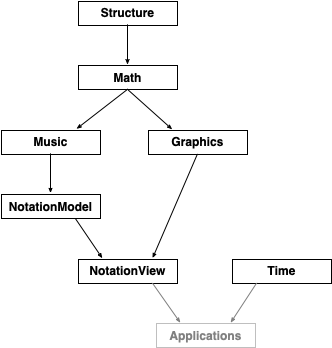

# dn-m docs

Welcome to the **dn-m** (dynamic notation for music) project. Here you will find documentation generated directly from the source code.

## Packages

The **dn-m** project currently consists of seven packages (each containing one or more modules): 

- [`Structure`](Packages/Structure/index.html)
- [`Math`](Packages/Math/index.html)
- [`Music`](Packages/Graphics/index.html)
- [`NotationModel`](Packages/NotationModel/index.html)
- [`Graphics`](Packages/Graphics/index.html)
- [`NotationView`](Packages/NotationView/index.html)
- [`Time`](Packages/Time/index.html)

The packages compose with and build upon each other:

## Development

The codebase for the **dn-m** project is written in the Swift language, and requires Swift version **4.2**.

### Installation

The packages within the **dn-m** project are managed by the [Swift Package Manager](https://swift.org/package-manager/).

You can clone any of the repositories from the command line. For example, to work on the `Music` package, you can do the following:

`git clone https://github.com/dn-m/Music && cd Music`

For fun, give things a test:

`swift test`

This will update and build all of the dependencies (e.g., the `Music` package depends on the `Math` and the `Structure` packages), and then run the unit tests.